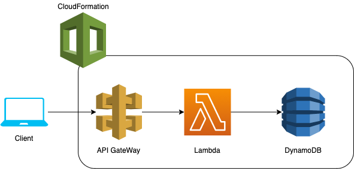

## UpsellX Collector

> Serverless app for fetching public data from a company website URL


#### Description
There is a single client facing API endpoint that accepts a "url". Then that site is scraped and social links are 
collected. If a Facebook link exists in the website data, then the Facebook page’s “about” section is again scraped for 
more data. The data is stored and then response returned to the user in the same request. If there is a repeat request 
with the same URL, data is not scraped again, but instead the data stored from the previous request is returned.


#### Usage

###### Requirements
- Docker
- Docker Compose

```
$ docker-compose up --build
```


#### Technologies Used
- Serverless for local development
- CloudFormation for maintaining written architecture.
- Lambda for implementing Function as a Service.
- DynamoDB is the NoSQL storage, where the data is stored.


#### System Diagram




#### API Endpoint

URL: /dev/collector

Sample Request:
```json
{
    "url": "https://mysite.com/"
}
```

Sample Response
```json
{
    "createdAt": "2020-10-09 03:05:46.949389+00:00",
    "website": {
        "fb": "https://www.facebook.com/mysite/",
        "linkedin": "https://www.linkedin.com/company/mysite/",
        "twitter": "https://twitter.com/mysite",
        "instagram": "https://www.instagram.com/mysite/",
        "youtube": "",
        "pinterest": ""
    },
    "id": "54894f08-09dc-11eb-ac4b-f39630d71423",
    "url": "https://mysite.com/",
    "fb": {
        "title": "My Site",
        "founded": "",
        "email": "hello@mysite.com",
        "phone": "",
        "about": "Making My Site Simpler, Faster",
        "categories": "Financial Service",
        "likes": "35,338",
        "talking": "724",
        "awards": "Forbes FinTech 50 2020 American Banker's Best FinTechs to Work for 2020",
        "mission": "Focused on changing the way My Site works.",
        "products": "My Site"
    },
    "updatedAt": "2020-10-09 03:05:48.067641+00:00"
}

```


#### Possible Improvements
- Use a Task Queue to scrape data in the background
- Refactor to organize the code better
- Improve security and data validation
- Scrape full data when "See More" appears in Facebook


#### License
MIT
